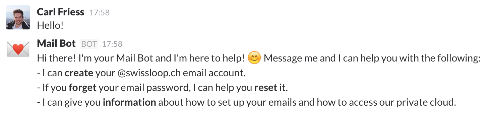

# Mail-in-a-Box Mail Bot

I developed this bot for a Slack team to allow team members to easily setup their email accounts on a [Mail-in-a-Box](https://mailinabox.email) server and help them get startet.



## Installation

Clone the repository and run npm install:
 
```
git clone https://github.com/carlfriess/miab-mail-bot.git
cd miab-mail-bot
npm install --production

```

Set up an admin account on your Mail-in-a-Box for the bot and adjust the configuration in `config.json`. You'll also need to [add a bot user](https://my.slack.com/services/new/bot) to your Slack team and copy the token to `config.json`.

Finally to run the bot type:

```
node app.js
```

## Configuration

The configuration for the bot is set in the `config.json` file:


| Field | Example | Description |
| ----- |:-------:| ----------- |
| **`token`** | `<YOUR_SLACK_TOKEN>` | Slack token |
| **`storageLocation`** | `path/to/data` | Directory to store data in. |
| **`adminContact`** | `@admin` | Who's the admin? |
| **`miab.domain`** | `box.your-domain.com` | Domain where the Mail-in-a-box is reachable at. |
| **`miab.emailDomain`** | `your-domain.com` | john.doe@_your-domain.com_ |
| **`miab.username`** | `mail-bot@your-domain.com` | The username for an admin account on the Mail-in-a-Box server. |
| **`miab.password`** | `<PASSWORD>` | The password for an admin account on the Mail-in-a-Box server. |

*All fields are required for the bot to work correctly!*

## Details

The bot is designed to allow exactly one email account per slack team member in the format `<first-name>.<last-name>@<domain>`. The bot remembers which email accounts belong to which slack user in a [database](https://github.com/flosse/json-file-store). The database is stored in the directory specified in the `config.json` file. This is important, because the bot allows users to reset their passwords.
